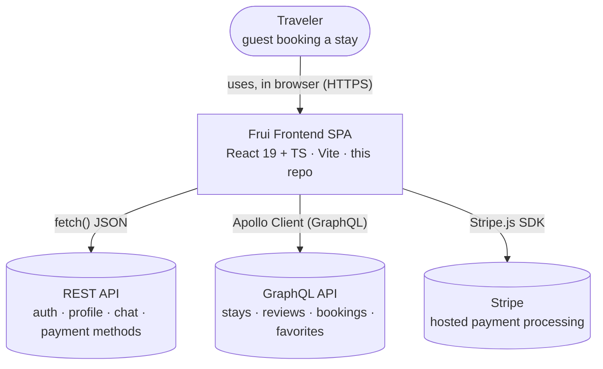
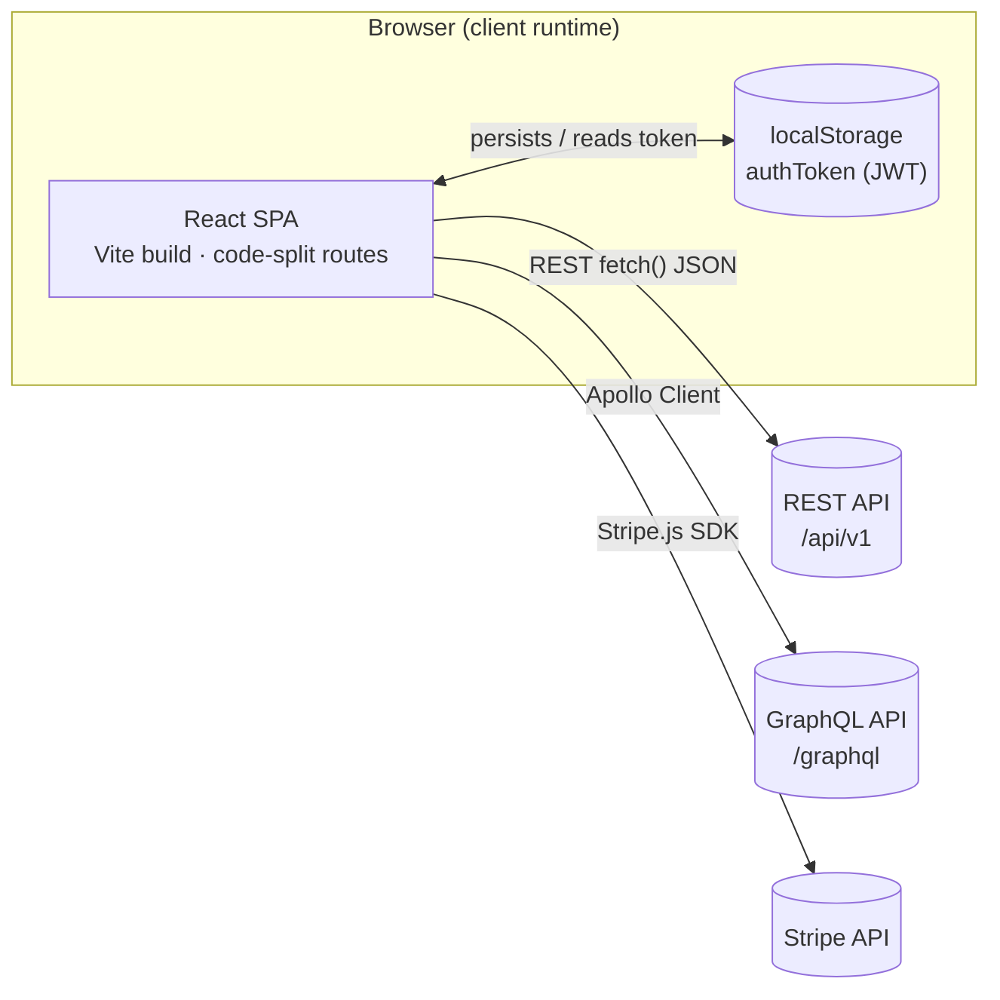
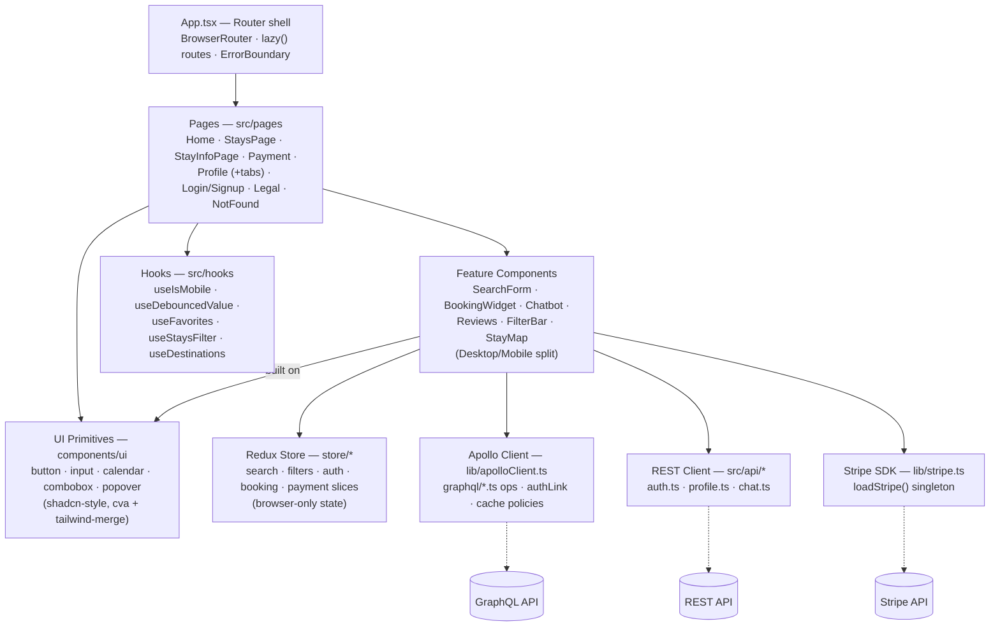

# Frontend Architecture (C4)

This document describes the architecture of the Frui frontend at three levels of zoom, following the [C4 model](https://c4model.com/): System Context, Containers, and Components. This is a frontend-only repository — it renders the UI and calls a backend REST API, a GraphQL API, and Stripe, none of which live in this codebase.

---

## Level 1: System Context

Who uses Frui, and which outside systems it depends on. The frontend never talks to a database or holds payment card data directly — it calls two backend APIs and hands card entry off to Stripe's own SDK.

The traveler only ever talks to the SPA. The SPA fans out to three independent external systems — it holds no server-side logic, and no card data crosses through it (Stripe.js tokenizes in an iframe it controls).

---

## Level 2: Containers

Because this repo produces a single deployable artifact, the interesting boundary at this level is the browser itself: what runs inside it, what persists across reloads, and which outside service each piece calls.

Everything inside the `Browser` boundary ships from this repo as one Vite bundle. State that must survive a reload (the auth token) lives in `localStorage`, not in Redux or Apollo's in-memory cache. It's read by both the Apollo `authLink` and `src/api/auth.ts`.

---

## Level 3: Components

Inside the SPA container: how a rendered page reaches down through feature components into the three ways this app gets or holds data — Redux for client-only UI state, Apollo for GraphQL data, and a thin REST client for the endpoints that have no GraphQL equivalent.

The desktop/mobile split described in `CLAUDE.md` happens inside the Feature Components layer, not shown per-component here. Pages don't call Apollo or Redux directly in most cases — they compose feature components that own that wiring.

### Key files

| Concern        | Files                                                      |
| -------------- | ---------------------------------------------------------- |
| Routing        | `src/App.tsx`, `src/main.tsx`                              |
| GraphQL data   | `src/graphql/*.ts`, `src/lib/apolloClient.ts`              |
| REST data      | `src/api/auth.ts`, `src/api/profile.ts`, `src/api/chat.ts` |
| Client state   | `src/store/*Slice.ts`, `src/store/hooks.ts`                |
| Payments       | `src/lib/stripe.ts`, `src/pages/Payment`                   |
| DTOs / mapping | `src/dtos/stayDTO`                                         |

---

_Reflects `project_lab_frontend` as of the current `main` branch. Backend REST and GraphQL services, and Stripe itself, are out of scope — this repo only contains the client shown above the Level 1 boundary._
